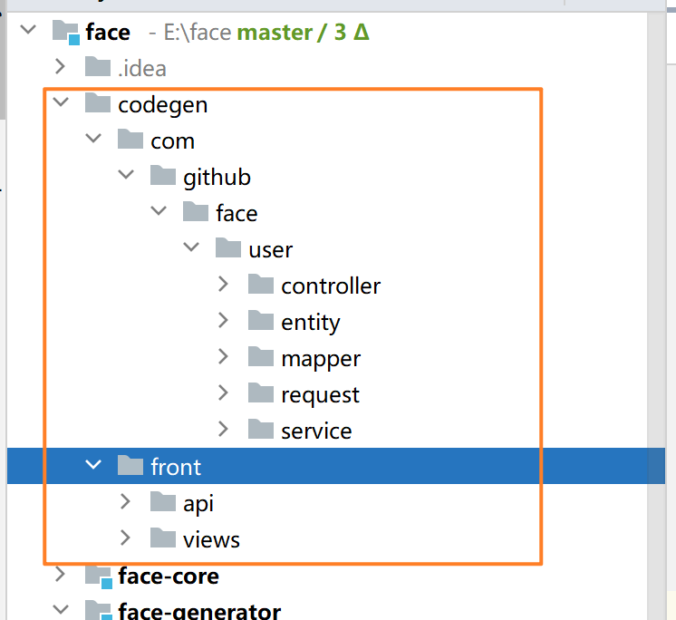

# 代码生成器

使用说明：

复制`application.example.yml` 为` application.yml`，修改参数，运行`GeneratorApplication`

 application.yml 参数说明 

```
reverse-domain: 公司的域名反转 默认cn.landdt
project: 项目名名称
module: dubbo service 所属模块的名称
router：controller 所属模块的名称
base-route：生成的controller @requetmapping的注解的前缀
tables：需要生成的表
table-prefix：entity 需要去掉的表名称的前缀，例如：takeaway_merchant 的前缀是takeaway_
# 域名反转 + 项目名构成基础包名，该项目所有报名都是以此为前缀 比如 cn.landdt.bz.onepass
# 基础包名 + module 构成 此module的包名前缀，比如 user module的包名前缀 cn.landdt.bz.onepass.user
# 基础包名 + router 构成 web层的包名前缀，比如 clint module的包名前缀 cn.landdt.bz.onepass.clint

```

## 生成的目录

api：api 模块里边的相关类

controller：controller 相关类

module：数据库、service的增删改查相关类

json：docway json

mybatis：mybatis xml

